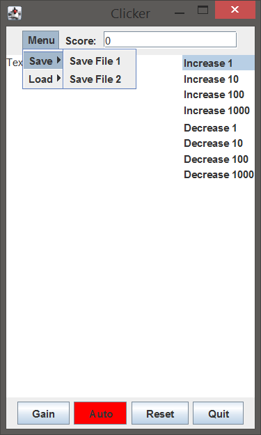

# MVCExample
A Basic Java MVC Example
 
Compile.bat - A bat file to compile all necessary files.
 
Run.bat - A bat file to run the program.
 
 
Button Fuctions:
1) Gain - Increase the Score by the value highlighted.
2) Auto - Automatically increase Score by 1 every second. Click to turn On/Off.
3) Reset - Set Score to 0.
4) Quit - Close Program.

Menu DropDown:
1) Save - Save "Text" and Score into a file in the folder "Saves".
2) Load - Load "Text" and Score from a file in the folder "Saves".
 

